# 🎓 Multi-RAG Q&A Chatbot with Learn & Quiz Modes

[](https://github.com/knightsri/ChatBot)
[](https://python.org)
[](https://streamlit.io)

**Learn how RAG works by asking questions OR test your knowledge with AI-generated quizzes!**

This application demonstrates RAG (Retrieval-Augmented Generation) through two interactive modes — perfect for learning, interview prep, or just having fun with trivia!

---

## 🎮 Two Modes of Operation

```mermaid
flowchart LR
    subgraph Learn_Mode["📖 LEARN MODE"]
        L1[You Ask] --> L2[RAG Retrieves]
        L2 --> L3[LLM Answers]
    end
    
    subgraph Quiz_Mode["🎯 QUIZ MODE"]
        Q1[RAG Generates Question] --> Q2[You Answer]
        Q2 --> Q3[LLM Evaluates]
        Q3 --> Q4[Feedback + Score]
    end
```



| Mode | You Do | Bot Does | Use Case |
|------|--------|----------|----------|
| 📖 **Learn** | Ask questions | Answer from documents | Research, learning |
| 🎯 **Quiz** | Answer questions | Ask & grade you | Trivia, interview prep, studying |

---

## 🚀 Quick Start

### 1. Install Dependencies

```bash
pip install -r requirements.txt
```

### 2. Set Up API Key

Create `.env` file, or enter the KEY in the UI (will not be saved to disk), with **either** key:

```
# Option 1: OpenAI (recommended)
OPENAI_API_KEY=your-key-here

# Option 2: OpenRouter (access multiple models)
OPENROUTER_API_KEY=your-key-here
```

If no key in `.env`, the app will prompt you to enter one.

### 3. Run the App

```bash
streamlit run chatbot.py
```

### 4. Try Both Modes

- The app randomly picks a topic on startup
- **Movie Trivia** defaults to Quiz Mode 🎯
- Other topics default to Learn Mode 📖
- Switch modes anytime using the sidebar toggle

---

## 🔑 API Providers

The app supports two API providers:

| Provider | Key Variable | Notes |
|----------|--------------|-------|
| **OpenAI** | `OPENAI_API_KEY` | Direct access, recommended |
| **OpenRouter** | `OPENROUTER_API_KEY` | Access many models via one API |

Priority: OpenAI key is used if both are present.

If no key is in `.env`, the sidebar will show an input field — enter your key and it hides away.

---

**RAG = Retrieval-Augmented Generation**

Instead of relying only on an LLM's training data, RAG retrieves relevant documents first, then uses them to generate better answers.

```mermaid
flowchart TB
    subgraph Without_RAG["❌ Without RAG"]
        Q1[Question] --> LLM1[LLM Only]
        LLM1 --> A1["May hallucinate 🤷"]
    end
    
    subgraph With_RAG["✅ With RAG"]
        Q2[Question] --> VDB[(Vector DB)]
        VDB --> CTX[Retrieved Context]
        CTX --> LLM2[LLM + Context]
        LLM2 --> A2["Grounded Answer ✓"]
    end
```



---

## 🎯 Quiz Mode Deep Dive

### How It Works


### Quiz Features

| Feature | Description |
|---------|-------------|
| **Dynamic Questions** | Generated from your RAG content — always relevant! |
| **Smart Grading** | LLM evaluates meaning, not exact wording |
| **Three Outcomes** | ✅ Correct (1 pt) • 🟡 Partial (0.5 pt) • ❌ Incorrect (0 pt) |
| **Skip Option** | Stuck? Skip and see the answer |
| **Progress Tracking** | Visual progress bar and running score |
| **Final Review** | See all Q&As at the end |

### JSON Configuration

Each knowledge base can configure its quiz settings:

```json
{
  "name": "Classic Movie Trivia",
  "icon": "🎬",
  "default_mode": "quiz",
  "quiz_questions": 10,
  "documents": [...]
}
```

| Field | Description | Default |
|-------|-------------|---------|
| `default_mode` | "learn" or "quiz" | "learn" |
| `quiz_questions` | Number of questions per quiz | 10 |

---

## 🔧 Extending the Code

This tutorial app is designed to be extended! Here are ideas:

### 💡 Quiz Mode Enhancements

```python
# Ideas for extending evaluate_quiz_answer():

# 1. Add difficulty levels
def evaluate_quiz_answer(user_answer, correct_answer, difficulty="medium"):
    # Adjust strictness based on difficulty
    pass

# 2. Add hints system
def get_hint(question, context):
    # Use LLM to generate a hint without giving away the answer
    pass

# 3. Add multiple choice option
def generate_multiple_choice(question, correct_answer, context):
    # Generate 3 wrong answers + 1 correct, shuffle
    pass

# 4. Track performance over time
def save_quiz_results(user_id, topic, score, date):
    # Store in database for progress tracking
    pass

# 5. Adaptive difficulty
def adjust_difficulty(recent_scores):
    # Make questions harder if user is doing well
    pass
```

### 💡 Interview Prep Mode

Transform this into an interview preparation tool:

```json
{
  "name": "Python Interview Prep",
  "default_mode": "quiz",
  "quiz_questions": 15,
  "documents": [
    {
      "title": "Python Data Structures",
      "content": "Lists are mutable sequences... Dictionaries store key-value pairs..."
    }
  ]
}
```

### 💡 Flashcard Mode

Add a simple flashcard mode for memorization:

```python
def flashcard_mode():
    # Show question on front
    # Click to reveal answer on back
    # Mark as "Got it" or "Study more"
    pass
```

---

## 📂 Knowledge Bases Included

| Icon | Topic | Default Mode | Description |
|------|-------|--------------|-------------|
| 🤖 | LLM Prompting | Learn | Prompt engineering best practices |
| ☄️ | 3I/ATLAS Comet | Learn | The 2025 interstellar visitor |
| 🥗 | Vegan Recipes | Learn | Plant-based cooking tips |
| ✈️ | Travel Planning | Learn | Trip planning strategies |
| 🎬 | Movie Trivia | **Quiz** | Behind-the-scenes film facts |
| 🦊 | Animal Facts | Learn | Amazing animal behaviors |

---

## 📁 Project Structure

```
your_project/
│
├── chatbot.py                 # Main application
├── requirements.txt           # Dependencies
├── .env                       # API key (create this)
├── logo.png                   # Optional custom logo
│
└── rag_data/                  # Knowledge base JSON files
    ├── prompting_llm.json
    ├── comet_3i_atlas.json
    ├── vegan_recipes.json
    ├── travel_planning.json
    ├── movie_trivia.json     # default_mode: "quiz"
    └── animal_facts.json
```

---

## 🧠 Key Concepts (For Beginners)

### 1. Embeddings

Text converted to numbers that capture meaning. Similar text = similar numbers.

### 2. Vector Database (ChromaDB)

Stores embeddings and finds similar ones fast. When you ask a question, it finds the most relevant chunks.

### 3. Chunking

Big documents split into small pieces (1000 chars). This makes retrieval more precise.

### 4. LLM as Evaluator

In Quiz Mode, the LLM doesn't just answer — it also judges if YOUR answer is correct. This shows LLMs can be used for many tasks beyond chatting.

---

## ⚙️ Configuration

### Sidebar Options

| Option | Learn Mode | Quiz Mode |
|--------|------------|-----------|
| Model | ✅ | ✅ |
| Temperature | ✅ | ✅ |
| Show Sources | ✅ | ❌ |
| Use Browser | ✅ | ✅ |
| Crawl Links | ✅ | ✅ |

### Quiz Settings (in JSON)

| Setting | Values | Effect |
|---------|--------|--------|
| `default_mode` | "learn" / "quiz" | Starting mode when topic selected |
| `quiz_questions` | 1-50 | Number of questions per quiz |

---

## 🎯 Try These Experiments

### Experiment 1: Quiz vs Learn

1. Select "Movie Trivia" (starts in Quiz mode)
2. Take the quiz
3. Switch to Learn mode
4. Ask questions about what you got wrong

### Experiment 2: Create Your Own Quiz

1. Create a new JSON in `rag_data/` with `"default_mode": "quiz"`
2. Add content about a topic you want to study
3. Quiz yourself!

### Experiment 3: Interview Prep

1. Add documents about your interview topic
2. Set `"quiz_questions": 20` for a longer session
3. Practice until you ace it!

---

## 🐛 Troubleshooting

### Quiz questions seem repetitive

- Add more content to your knowledge base
- The app tracks recent questions to avoid repeats

### Grading seems unfair

- The LLM looks for meaning, not exact words
- If partial credit seems wrong, try rephrasing

### Loading is slow when switching topics

- Normal! Embeddings are being recalculated
- Watch the spinner for progress

---

## 📖 Learn More

- [LangChain Documentation](https://python.langchain.com/)
- [OpenAI Embeddings](https://platform.openai.com/docs/guides/embeddings)
- [ChromaDB](https://docs.trychroma.com/)
- [Streamlit](https://docs.streamlit.io/)

---

## 🚀 What's Next?

After mastering this tutorial:

1. **Build your own knowledge base** for studying or interview prep
2. **Add persistent scoring** to track progress over time
3. **Implement difficulty levels** for adaptive learning
4. **Create a multiplayer mode** for trivia competitions
5. **Deploy to Streamlit Cloud** and share with friends!

---

*This tutorial demonstrates how RAG can power both Q&A systems AND quiz/assessment tools. The same retrieval + generation pattern applies — only the direction changes!* 🎓
